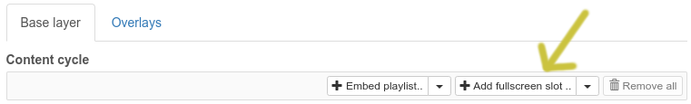
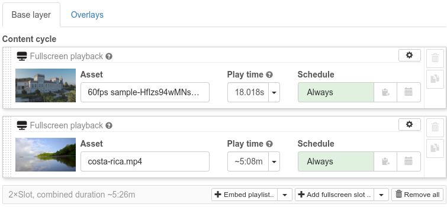
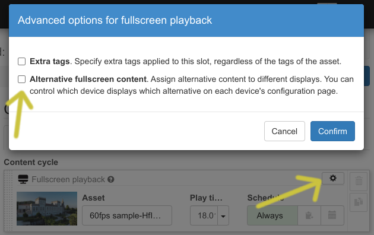
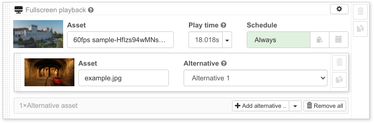
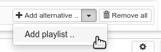
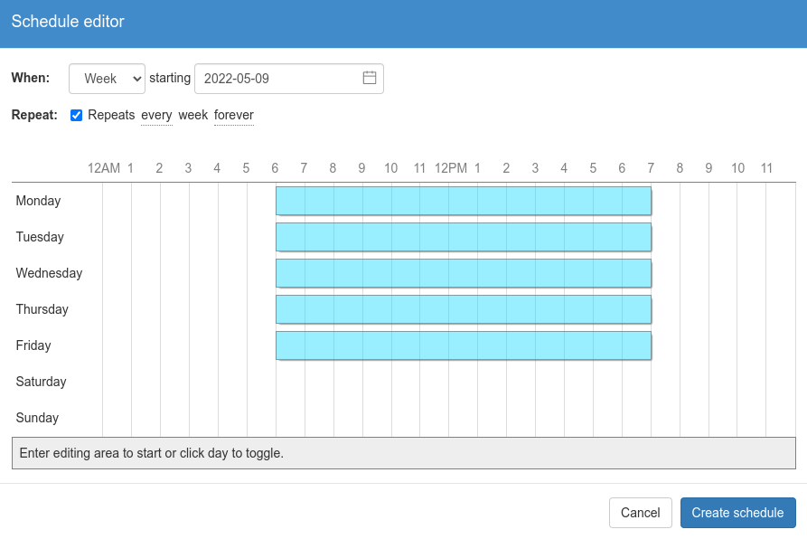
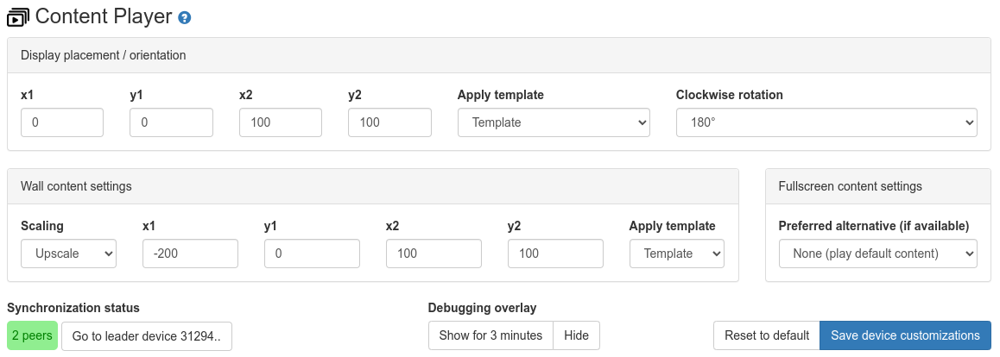

A media player supporting FullHD videos and images. Each playlist slot can be
individually scheduled. There are two playback modes for each slot: Video wall
or fullscreen.

For video wall slots, multiple devices can work together and the content can be
spread across your displays. The layout for each display is highly configuable
allowing you to (for example) build 2x2 or even larger installations.

Fullscreen slot play content on a single display. If multiple devices run the
same setup, they will play content synchronized. Additionally you make
individual display play alternative content. This can be used to (for example)
have a synchronized playback for installations like a food menu where multiple
displays show different images.

Fullscreen and video wall slots can be freely mixed. Scheduled videos and images
can optionally be overlayed with additional plugins. This can be used to add
scrollers or other content. Overlays can be individually scheduled and can use
conditions to decide when they are active.

Multiple devices in a local network all running the same setup will
automatically form a peer group and synchronize playback of content by selecting
one leader device that controls the group. Make sure you have the P2P
(peer-to-peer) feature enabled for all devices and configured your network to
allow cross device communication.

# Alpha release

This is a first release of this package. The package includes a number of new
features not previously available on info-beamer hosted. As such it's still
considered experimental. You're welcome to use this package but should be aware
that things might not always 100% work. Feedback is very welcome.

# Usage guide

## Creating a content cycle

You create a content cycle similar to other package (like the HD player for
example). Each item is individually scheduled. Embedded playlists provide
bring their own scheduling with them.

### Fullscreen slots

When you open the setup's configuration page, the simplest method of adding
content is to click on the "Add fullscreen slot" button to add one or more
images or videos to your playlist:

Then select the images/videos from the popup. Your newly added content will be
appended to the playlist:

Content added to fullscreen slots will by default play fullscreen on any device
you assign the setup to. If you assign the same setup to multiple devices within
the same network, all playback will be synchronized. You can optionally
transform the output so it is rotated or scaled into a specified area. This can
be used if you're using rotated display or video wall processors which required
cropped output. See [device specific settings](#devicecontrol) below for more
information.

#### Alternative content

Each fullscreen slot can have additional alternative content. This can be used,
for example, when you want to display different images/videos on each display
but still synchronize your playback. One use case might be a food menu where
each display shows a different part of the menu. In that case you can configure
each device to prefer a different alternative and then use alternative content
feature within that playlist slot. For that, click the cogwheel icon, then
enable "Alternative fullscreen content" in the popup:

The slot will now allow you to add alternative content: Click on the "Add
alternative" button and select one or more alternative assets. They will be
added to the playlist slot like this:

The "Alternative" dropdown menu option allows you to select which alternative
slot this assets is assigned to.

You can then specify which alternative slot each device should preferrably play
on its device detail page. There are a total of 8 alternative slots available.
If you add multiple assets to the same alternative slot the device will loop
between all alternatives for that slot each time the slot is active.

Additionally if you have the same number of assets in multiple alternative
slots, they will always play in sync. So if you have item1, item2 and item3 as
"Alternative 1" and item4, item5 and item6 as "Alternative 2", item1 and item4
will always play together.

Instead of adding a single asset you can also add one of your playlists and
assign all of its items to an alternative slot. Use the dropdown menu and select
"Add playlist..", then select the playlist you'd like to add.

### Embedding playlists

Within your content cycle you can also embed your [playlists created in your
account](/playlists) to the content cycle. Click on the "Embed playlist.."
button, then select a playlist.

When using embedded playlist and assign the setup to multiple devices, all
devices will play the content in sync on all devices. Scheduling information
specified in the playlist is used to decide when to play each item.

### Video wall slots

Video wall slots are similar to fullscreen slots but during playback content
will potentially be spread across multiple displays if assigned to multiple
devices. Placement of each individual display is managed not within the setup
itself but on each [device's detail page](#devicecontrol). See the 
"Device specific configuration" for more information on how to configure each
device within a video wall type installation.

## Slot playback time

You can change the individual play duration for each item. By default it's
pre-filled to 10 seconds for images and uses the video's duration for any video
content. If you do not want to configure a fixed duration (which might be useful
during API based automation) you can also set the duration to 0. This
will then use the same auto detection of playback time but doesn't require you
to set a fixed value. Minimum playback time of any kind of item is 2 seconds.

## Slot scheduling

Each slot added to your content cycle can be individually scheduled. By default
each added item is always scheduled. The greenish "Always" indicates that. You
can click it to switch between "Always" and "Never".

If you want to schedule an item according to a custom schedule, click the small calendar
icon within the schedule configuration button. It will open up a schedule editor. You
can specify the type of schedule (month, week or day) and set a start and optional end
date. Additionally you can specify if and how the schedule should be repeated. Within
the editing area you can then click and hold to set multiple active range within the
day, week or month.

You can control the device's timezone on the device list page. Select a device, then
select "Modify device.." and select "Set timezone..".

When using embedded playlists, the scheduling information from the playlist is
used.

### Copying schedules

You can use the two clipboard buttons next to customized schedules to copy and paste
each schedule. If want multiple playlist slots have the same schedule, copy the schedule,
then paste on each slot. Alternatively after you've pasted to one slot you can hold
'SHIFT' and paste on another slot. The editor will copy the schedule to all items between
the two slots.

### Editing an existing schedule

Use the "Edit.." button to edit a schedule for a playlist item. Note that this will only
change the schedule of that individual item. Copied schedules are not affected, so you'll
have to copy any change to other playlist slots again if needed.

You can remove a custom schedule by clicking on the "X" symbol. This will remove the
custom schedule and revert the playlist slot to "Always".

# Playback settings

The package supports various settings to specify how playback behaves. There are
general as well as advanced settings.

## General settings

You can set fallback content for both horizontal as well as vertical devices.
Only images are supported as fallback. They are shown on the display if nothing
can be played. There are multiple reasons this might be the case:

 * No slot is currently scheduled: If you have created custom schedules for your
   items and none of them is currently active, no slot can play and instead the
   fallback is active.

 * The device doesn't have a correct time and your playlist contains only custom
   scheduled items. In that case the decision on whether or not an items can
   play cannot be made yet and only the fallback content remains.

 * If you use multiple devices in synced playback and network connectivity
   between the leader and a follower device is lost. In that case the following
   device might not receive the command the play the next content and will fall
   back to showing the fallback content after a few seconds.

The settings also allow you to specify how devices should behave when only
playing fallback content. You might have a content cycle that only has items
scheduled to play during the day. In such a case you might set the "When playing
only fallback" option to "Turn off displays". The attached displays will turn
off after a few seconds once nothing is scheduled any more and will turn back on
automatically once items get scheduled again.

## Advanced settings

### Content scaling

Both fullscreen and video wall slots play content within a configurable canvas.
For fullscreen slots that usually the full display size of a device. In case of
video walls slots its the locally detected resolution upscaled according to the
placement configuration made on each device detail page. In both cases this
canvas size might have an aspect ratio that doesn't necessarily match the aspect
ratio of the content. For example you might try to play 4:3 (for example a
1024x768 image) on a 16:9 FullHD display. The default is scale the
content into the available canvas while preserving the aspect ratio. For the
above example this might result in a centered image with free space to the left
and right of it.

### Virtual resolution

By default the content assumes a 1920x1080 (FullHD) virtual resolution. This
means that content is expected to have a 16:9 aspect ratio. Note that this
resolution doesn't necessarily need to correspond with the physical resolution
or aspect ratio of displays. If you have an anamorphic video wall with
non-square pixels, it might happen that you need to generate a HDMI signal
with with an aspect ratio different from the detected output resolution.

Note that this also doesn't limit the generate output resolution. So you can
still show 4K images on a 4K display without loss of resolution, even if you
select 1920x1080 canvas as 16:9 content will be upscaled to the physical
resolution without loss of precision.

### Audio

Enabling audio will allow audio playback for videos. Be sure to also configure
each device to support audio playback using either analog output or HDMI. Use
the configuration editor on each device's detail page for that.

### Slot fusing

Slot fusing allows continued playback of identical assets in consecutive slots.
For example if you use two fullscreen slots with alternative contents you might
use different images as the default content. You can then use the same video
file as "Alternative 1" in each slot. When slot fusing is enabled, the video
playback won't restart when playback switches to the seconds slot as the same
video is assigned there as well.

Similarly if you use overlays and they are active across multiple playlist
slots, slot fusing allows continuous playback of those overlays. If slot
fusing is disabled, each overlay will restart for each slot. This might
make a difference when combined with the fade/reveal option below.

### Fade/Reveal effect (reveal)

The player provide an option for controlling how transitions between
content works: Videos and images can fade in/out, while scrollers can
move in or out from the sides of the screen. Enabling this option will
control the effect for all content and overlays.

# Device specific configuration (devicecontrol)

Some playback settings are not part of the setup itself but part of the device's
configuration. Once you assign a setup to a device, go to the device's detail
page and scroll down to the "Content Player" section:

Setting you make will be saved and synced to the device when clicking "Save device customization".

## Display placement

The four percent values `x1`, `y1`, `x2` and `y2` can normally left at their
default of 0, 0, 100, 100. They specify an initial transform applied to all
output generated by the setup. By default the complete physical resolution will
be used from the pixel at the very top left (at 0, 0) up to the bottom right
pixel at 100% width/100% height. Some video walls will crop a fixed area from the
top-left of the HDMI video signal a device generates. In that case the `x2` and
`y2` can be used to place all content within that area. You can also use these
settings to compensate for overscan in case you cannot force your display to show
the complete HDMI output.

The clockwise rotation allows you to rotate all content within the target area
defined by the settings above.

## Wall content layout

The four values `x1`, `y1`, `x2` and `y2` allow you to specify the screen area
used to display your video wall content. The values are specified on "percent of
available screen space". The default for `0` for `x1` and `y1` means the top
left corner, while  `100` for `x2` and `y2` is the bottom right corner of the
display. You can specify your own values or use the template dropdown to select
and apply among a selection of presets.

The values do not necessarily have to be between `0` and `100`. If you use
values outside of that range, you can, among other things, configure multiple
devices to act as a single screen area for a video wall type setup.

## Fullscreen content settings

By default each device will play from the primary default content configured in each
fullscreen slot. With this setting you can specify that a device should play
the specifed alternative content instead if configured for a slot. In case of a
food menu with 3 side-by-side displays it might for example make sense to use
the default content for the left display, 'Alternative 1' for the middle display
and 'Alternative 2' for the right display. Within a playlist you can then
configure alternative content accordingly for each fullscreen slot to specify
which display is used for playback.

## Alternative content

As already discussed in the playlist configuration above, each playlist slot can specify
alternative content. You can use the "Preferred alternative" dropdown to select which
of those alternative content the device should play. If a playlist slot doesn't have
any configured content for the selected alternative, the device will play the default
content instead.

## Debugging

You can identify a device and show various debugging values by clicking on the "Identify screen"
button. This will show an overlay above the normal content on the device for the next 3 minutes.

## Synchronization Status

Multiple devices in the same network running the same setup will automatically form a group
of devices. The status shows the device role (leader or follower). Use the "Go to leader" on
a follower device to go to the device detail page of the leader device.

# Howto

## Synchronized playback

Here's how you create a setup that shows different but synchronized content on a group of
devices:

 * Create the playlist for a single device using the "Add playlist slot.." button.
 * Click on "Add alternative asset" on each playlist slot, add the alternative asset for
   a second display and select "Alternative 1".
 * Repeat for each additional display: Add another asset, and select "Alternative 2", etc..
 * On each device that should play alternative content, go to the device page after assiging
   the setup and select the alternative in the dropdown. Then click on "Save device customization".

## Video wall

This package can be used to show video wall content across a number of devices. As an example,
a 2x2 video wall can be set up as follows:

 * Create the playlist using the setup configuration editor and assign the setup to the four
   devices.
 * Go to each device's individual device details page and use the "Apply layout template"
   dropdown. Select the correct 2x2 option for each of the four devices, then click on
   "Save device customization".

# FAQ

## My content isn't synced

This packages uses Peer-to-Peer communication between devices for synchronization. This
is necessary due to the potentially complex scheduling of individual items. When a setup
is installed on a group of devices in a local network, they automatically select a leader
device. This leader device then controls the playback of all other devices running the
same setup. A usable network environment is required for this: When you visit a device's
detail page, in the Peer-to-Peer information on the right side should show all participating
devices. If you only see a single device, this usually means that the device is isolated
for some reason and cannot contact other devices. If you're running an installation on
a WiFi network, the client isolation feature of WiFi might be the reason for that.

Similarly you can see information about the synchronization of your devices on the 'Content
Player' section of each device's detail page. It also shows the number of detected peers
for the installed setup. The number should be equal to the number of devices you want
to sychronize.

Another reason might be packet loss. The sychronization requires devices talking to each
other. If a lot of transmitted information is lost due to packet loss, synchronization
might not work and you might see devices reverting back to playing the fallback content.

Be sure the connectivity of the devices is working well: Either use Ethernet, which usually
doesn't have this problem, or be sure to use a WiFi network with a strong enough signal.

# Changelog

## Version beta-2

 * Start with first item on initial playback.
 * Content-process content (like the browser) show their last frame if their
   node directory (and service) is deleted due to switching to another setup
   based on this package. This avoids showing just a black screen.

## Version beta-1

 * Support explicit start and end time within a schedule specification.
   This updates is mandatory if you use such a schedule.

## Version alpha-6

 * Documentation and first release cleanup.

## Version alpha-5

 * Updated to work together with packages like power saver, if the
   "Show fallback content" option is selected. When "Turn off display"
   is selected, the package expects it to be in control of the display
   though, so you should not mix it with the power saver in that case.

## Version alpha-4

 * Fixed device status on device detail page not getting updated after
   one day of device uptime.

## Version alpha-3

 * Added features to default overlay: It adds some features from the
   old HD player like Ken burns effect as well as progress indicators.
 * Overlay can now loop through l-wraps, bottom/side images or logos
   placed on top of the main content.

## Version alpha-2

 * Added optional playlist slot fusing: If you assign the same asset to two
   or more consecutive playlist slots, the playback for a video won't restart
   but instead continues across slots.
 * Added initial support for content child nodes.
 * Added initial support for overlay child nodes.

## Version alpha-1

 * Initial public release
